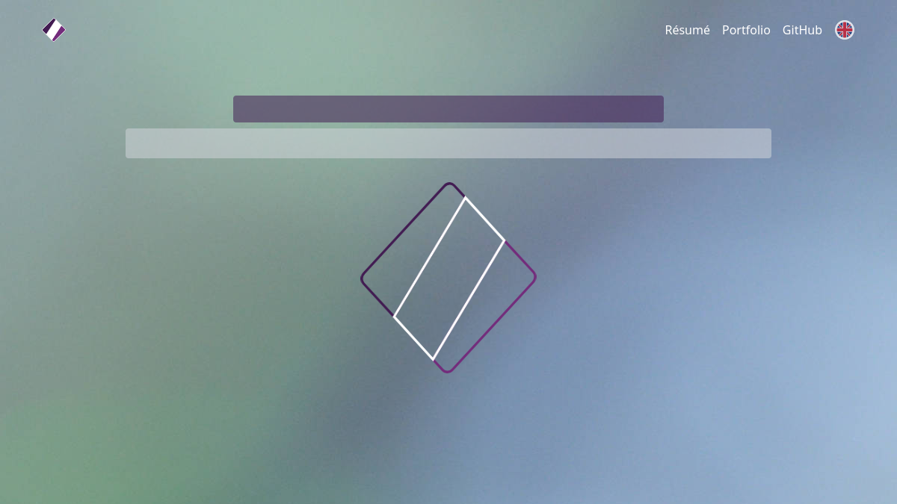
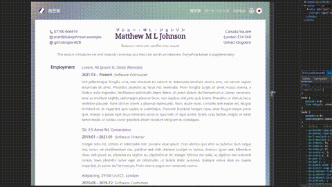
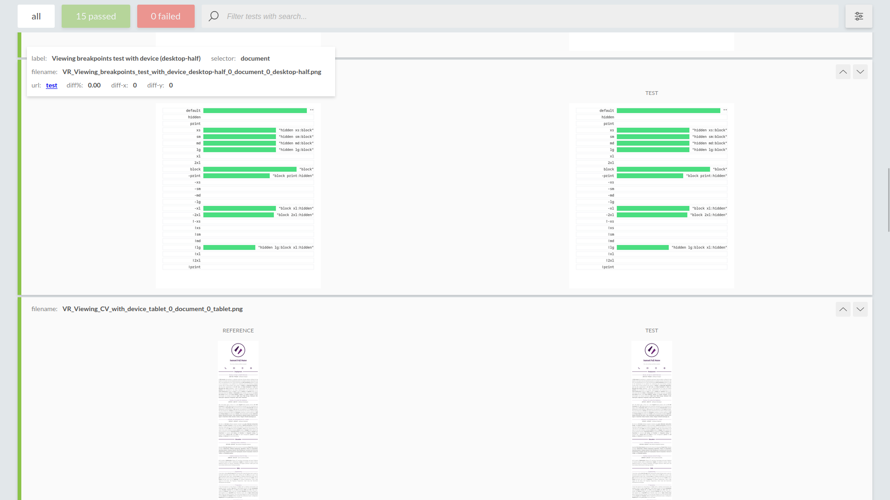
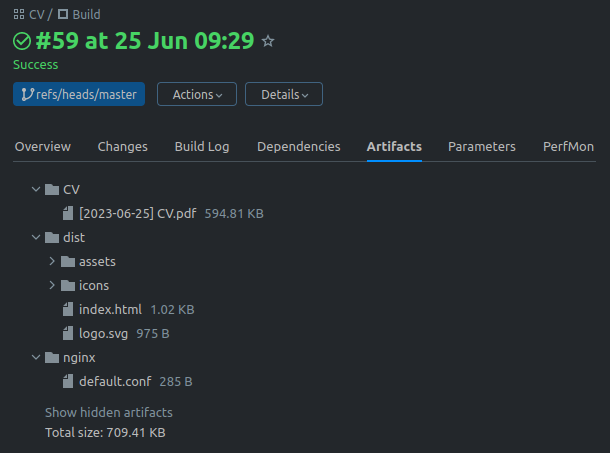

# Portfolio

This is an SPA and backend for my portfolio and CV (curriculum vitae; résumé), built with **Vue.js**,
**Tailwind CSS**, **Vite** and **Express**.

<div style="text-align: center"></div>

**Responsive** - Developed with mobile, tablet, and desktop in mind. _NB: Dummy data is used in previews._

<div style="text-align: center"></div>

## Getting started

This software expects you to have **Node 20.x** and uses the **pnpm** package manager.

### Install dependencies

```shell
npm install -g pnpm
pnpm install
```

### Build and run

Development

```shell
pnpm run run:dev
```

Production

```shell
pnpm run build:prod
pnpm run run:prod
```

---

Tests include linting with **Prettier** and **ESLint**, and visual regression testing with **Puppeteer** and
**BackstopJS**. Additional details are further down the page.

```shell
pnpm run lint
# First ensure that services are running, then
pnpm run test
```

---

Generate a PDF of the CV with

```shell
pnpm run pdf
```

or use the **Print to PDF** function in your browser. All the components properly handle the `@media (print)` media
query so printing the web page should output a perfectly laid-out document.

### Visual regression testing

Visual regression testing is done with BackstopJS, comparing against the images in
`./visual_regressions/bitmaps_reference/` and `./visual_regressions/pdf_test/png/`.

You can approve visual changes with `pnpm run approve` which will update the reference images.

Here's what a typical test report looks like:



## CI/CD pipelines

This is what the TeamCity pipelines for this project look like!


...and the artifact output...



Scripts and configuration files related to the pipelines can be found in the `.teamcity/` directory.

## Licencing

While this software is open source, it is proprietary and subject to copyright and usage restrictions. Please refer to
the `LICENCE` file for details.
